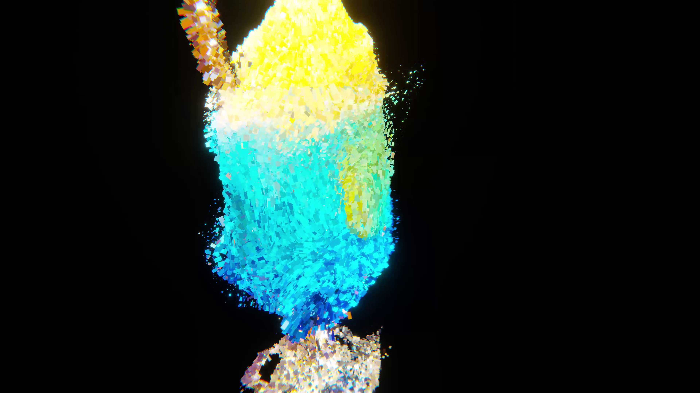

# LumaAI-Unity-VFX-Showcase

## About

LumaAIで出力した.ply点群をUnity VFX Graphで演出するデモンストレーションです。

[Demo Video (Youtube)](https://www.youtube.com/watch?v=rc-XasUg4J8)

## Environments

- Windows 10 Home / 11 Home
- Unity 2021.3.4

- Visual Effect Graph
- Cinemachine
- Unity Recorder
- keijiro / Pcx

## Install & Usage

`Assets/LumaAIUnityVFXShowcase/Scenes/Main`シーンを開き再生します。

## Licenses

- [keijiro/Pcx](https://github.com/keijiro/Pcx)
  Unlicensed License

## Author

[にー兄さん](https://twitter.com/ninisan_drumath)
